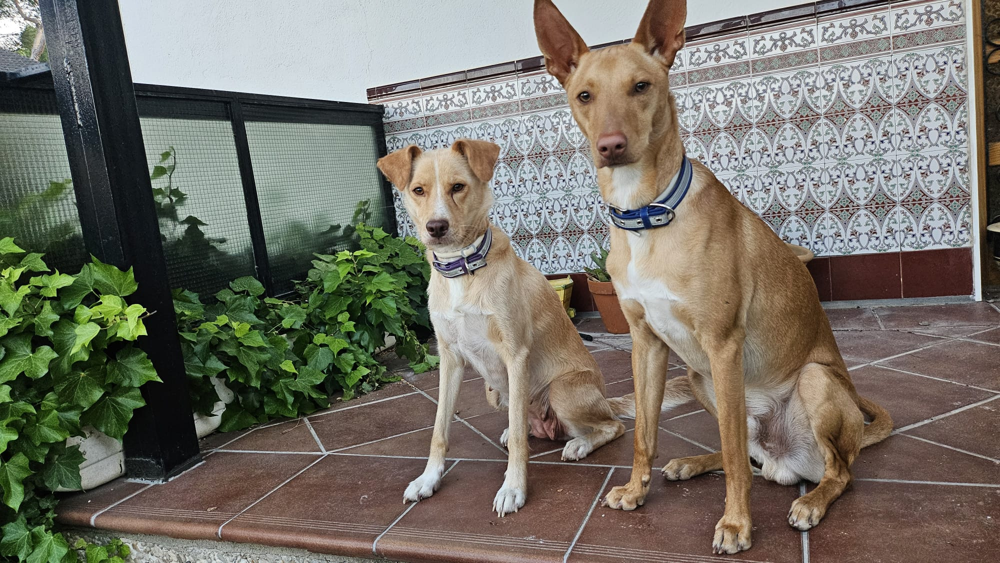
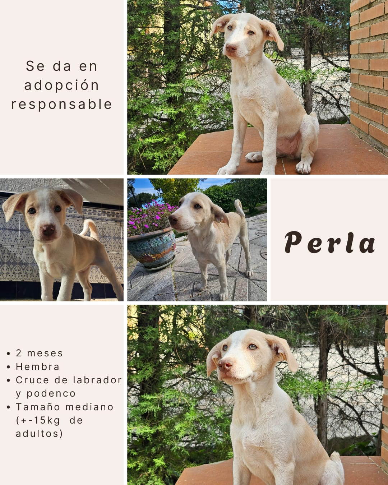
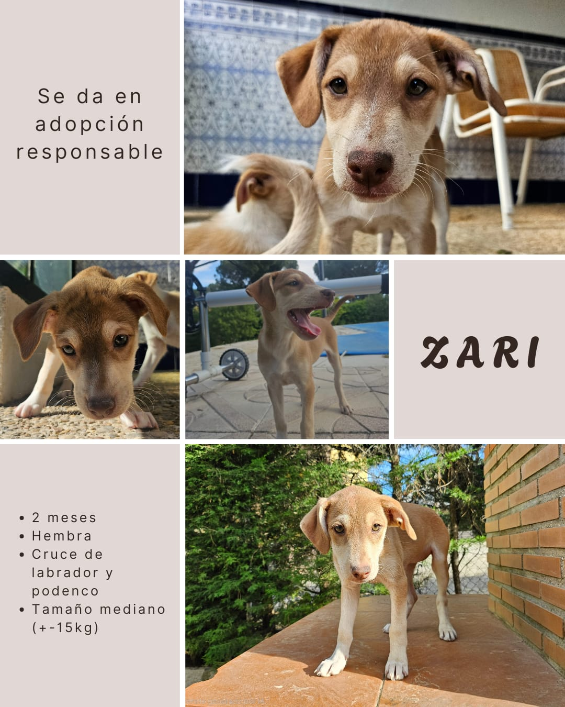
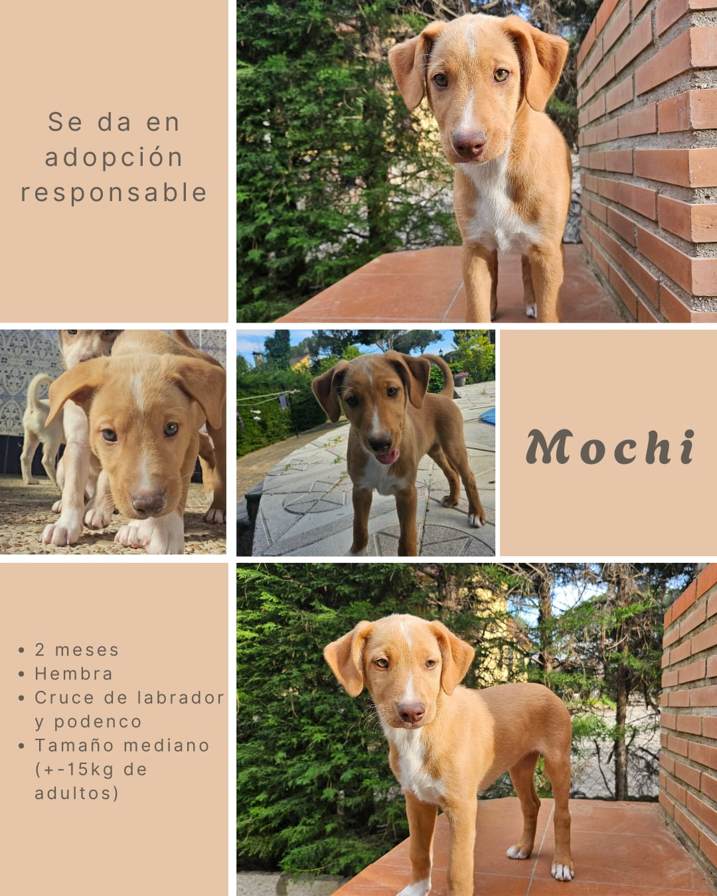
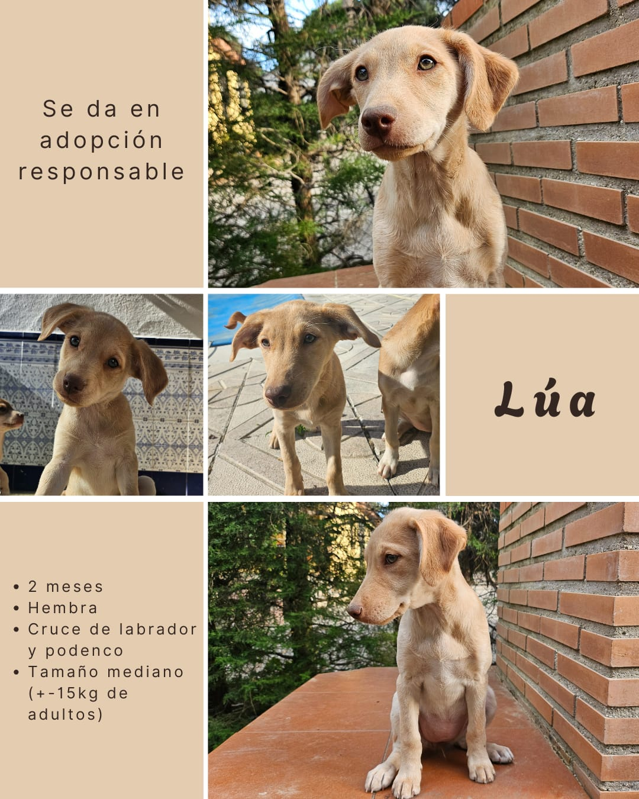

# ¡Cachorros en adopción responsable!

Presentamos a nuestros siete pequeños: 
🩷 Zari, Mochi, Polar, Perla y Lúa 

Nacidos el 11 de marzo de 2025, son cruce de podenco.
Su mamá, de 13 kg, es mezcla de labrador y podenco, y su papá un podenco andaluz de unos 18 kg.

Son cachorros sanos, cariñosos, juguetones y muy sociables. Tienen una vitalidad preciosa y están listos para encontrar una familia definitiva que les brinde amor, atención y un entorno seguro donde crecer felices.

**Buscamos adopciones responsables.** 

Si estás interesado/a, escríbenos via WhatsApp al número 633554679,  contándonos un poco sobre ti y tu entorno:
- ¿Quiénes componen la familia y sus edades?
- ¿Tienes o has tenido animales antes?
- ¿Dónde vives (provincia/localidad)?
- ¿Qué estilo de vida tenéis?
- ¿Disponéis de tiempo, espacio y ganas para dedicarles amor y cuidados?

Queremos asegurarnos de que cada uno de ellos llegue al hogar ideal.

## Sus padres
Para que os hagáis una idea, aquí sus padres. 

  

## Los cachorros

  
  
  
  
  

